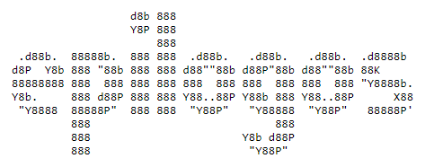

<p align="center">
  <br>
  <a href="https://github.com/meuleman/epilogos"></a>
  <br>
</p>

<br>

---

<h2 align="center">
    Insert TagLine Here
</h2>

Epilogos is an approach for analyzing, visualizing, and navigating multi-biosample functional genomic annotations, with an emphasis on chromatin state maps generated with e.g. ChromHMM or Segway.

The software provided in this repository implements the methods underlying Epilogos using only python. We provide a proof-of-principle dataset based on chromatin state calls from the BOIX dataset.

<br>

---

<div align="center"><a name="menu"></a>
  <h3>
    <a href="#prerequisites">Prerequisites</a> •
    <a href="#running-epilogos">Running Epilogos</a> •
    <a href="#minimal-example">Minimal Example</a> •
    <a href="#command-line-options">Command Line Options</a> •
    <a href="#pairwise-epilogos">Pairwise Epilogos</a>
  </h3>
</div>

---

<br>


<a name="prerequisites"></a>

## Prerequisites

To compute epilogos, you will need to have the following python libraries: [click](https://click.palletsprojects.com/en/7.x/), [numpy](https://numpy.org/), and [pandas](https://pandas.pydata.org/). These can be installed with the following command.
```bash
$ pip install click, numpy, pandas
```
Additionally, it is recommended that python is updated to version 3.7 or later. In earlier versions, `src/computeEpilogosScores.py` may raise an OSError 16. It is worth noting that in our testing this error has not affected the results. 

<a name="running-epilogos"></a>

## Running Epilogos

A single python script, `src/computeEpilogosSlurm.py`, controls all of the processing. To be presented with minimal documentation of arguments needed to run epilogos, simply run python `src/computeEpilogosSlurm.py --help` (More in-depth explanation is given [below](#command-line-options))

The script, `src/computeEpilogosSlurm.py`, requires access to a computational cluster managed by [SLURM](https://slurm.schedmd.com/). A minimal version of epilogos, `src/minimalEpilogos.py`, has been created for those without access to a SLURM cluster. It functions identically to `src/computeEpilogosSlurm.py` but runs everything within one terminal command.

<a name="minimal-example"></a>

## Minimal Example

Sample data has been provided under `~/epilogos/data/pyData/male/`. The file, `epilogos_matrix_chr1.txt.gz`, contains chromatin state calls for a 18-state chromatin model, across 200bp genomic bins spanning human chromosome 1. The data was pulled from the [BOIX dataset](https://docs.google.com/spreadsheets/d/103XbiwChp9sJhUXDJr9ztYEPL00_MqvJgYPG-KZ7WME/edit#gid=1813267486) and contains only those epigenomes which are tagged `Male` under the `Sex` column

To compute epilogos (using the S1 saliency metric) for this sample data run one of the following commands (depending on if you want to use SLURM or not) within the `~/epilogos/` directory (replacing `OUTPUTDIR` with the output directory of your choice).

Slurm: `$ python ./src/computeEpilogosSlurm.py -f ./data/pyData/male/ -s 18 -o OUTPUTDIR`

Non-Slurm: `$ python ./src/minimalEpilogos.py -f ./data/pyData/male/ -s 18 -o OUTPUTDIR`

Upon completion of the run, you should see the files `exp_freq_male.npy` and `scores_male_epilogos_matrix_chr1.txt.gz` in `OUTPUTDIR`

To customize your run of epilogos see the [Command Line Options](#command-line-options) of the `README`

<a name="command-line-options"></a>

## Command Line Options

<a name="input-directory"></a>
<details><summary><b> Input Directory (-i, --input-directory)</b></summary>
<p></p>
<p>Rather than just read in one input file, Epilogos reads the contents of an entire directory. This allows the computation to be chunked and parallelized. Additionally, it allows users to separate data as makes sense to them (e.g. split up the genome by chromosome)</p>

<p>
The argument to this flag is the path to the directory which contains the files to be read in. Note that ALL files in this directory will be read in and errors may occur if other files are present.
</p>
</details>

<a name="output-directory"></a>
<details><summary><b> Output Directory (-o, --output-directory)</b></summary>
<p></p>
<p>
The output of Epilogos will vary depending on the number of input files present in the input directory (-f, --file-directory). All scores files will be gzipped txt files and of the format <code>scores_{}_s$_[].txt.gz</code> where <code>{}</code> is replaced with the input directory name, <code>$</code> is replaced with the saliency level, and <code>[]</code> is replaced with the name of the corresponding input file (extensions removed).</p>
<p>
The argument to this flag is the path to the directory to which you would like to output. Note that this may not be the same as the input directory.</p>
</details>

<a name="state-model"></a>
<details><summary><b> State Model (-n, --number-of-states)</b></summary>
<p></p>
<p>The argument to this flag specifies the number of distinct labels (chromatin states) provided in the input data.</p>
</details>

<a name="saliency"></a>
<details><summary><b> Saliency Level (-s, --saliency)</b></summary>
<p></p>
<p>Epilogos implements information-theoretic metrics to quantify saliency levels of datasets. The <code>-l</code> flag to the coordination script allows one to choose one of three possible metrics:</p>
<code>
1. Metric S1, implementing a standard Kullback-Leibler relative entropy
2. Metric S2, implementing a version of S1 that additionally models label co-occurrence patterns
3. Metric S3, implementing a version of S2 that additionally models between-biosample similarities
</code>
<p>
Note that each increase in saliency level involves much more computation and thus each increase requires more time and computational power.
</p>

<p>
The arguement to this flag must be an integer <code>1, 2, or 3</code>. Note that Epilogos defaults to a saliency of 1.
</p>
</details>

<a name="mode-of-operation"></a>
<details><summary><b> Mode of Operation (-m, --mode-of-operation)</b></summary>
<p></p>
<p>As epilogos has 2 different types of output files, we allow the user to designate which they would like to receive and thus minimize potentially repeated computation.</p>

<p>
The argument to this flag must be one of three strings: <code>bg</code>, <code>s</code>, <code>both</code>. If you would like to calculate only the background frequencies of the chromatin statesm use <code>bg</code>. If you already have a file containing the background frequencies and would only like to calculate the per state scores, use <code>s</code>. If you would like to calculate both the background frequencies and the scores, use <code>both</code>. Note that Epilogos defaults to <code>both</code>.</p>
</details>

<a name="background-directory"></a>
<details><summary><b> Background Directory (-b, --background-directory)</b></summary>
<p></p>
<p>In the case that the user chooses <code>s</code> as the mode of operation, the argument to this flag is the directory in which the background frequency file resides. Note that the file must maintain the same name as it was given upon original output. The format for this name is <code>exp_freq_{}.npy</code> where <code>{}</code> is replace with the name of the input directory. Note that Epilogos defaults to the ouput directory.</p>

<p>
In the case that the user chooses either <code>bg</code> or <code>both</code> as the mode of operation, the argument to this flag is the directory to which the background frequencies should be written. This is in case you want the background frequency output directory to be different from the score output directory. Note that Epilogos defaults to the ouput directory.</p>
</details>

<a name="number-of-cores"></a>
<details><summary><b> Number of Cores (-c, --num-cores)</b></summary>
<p></p>
<p>Epilogos will always try and parallelize where it can. Computation done on each input file is parallelized using python's <a href="https://docs.python.org/3/library/multiprocessing.html">multiprocessing library</a>.</p>

<p>
The argument to this flag is an integer number of cores you would like to utilize to perform this multiprocessing. Note that Epilogos defaults to using all available cores (equivalent to <code>-c 0</code>).</p>
</details>

<a name="exit"></a>
<details><summary><b> Exit When Submitted (-x, --exit)</b></summary>
<p></p>
<p>By default `src/computeEpilogosSlurm.py` only exits after it has completed all slurm jobs and prints progress updates to the console. If you would like the program to instead exit when all jobs are submitted (allowing use of the terminal while the jobs are running), enable this flag.</p>
</details>

<a name="pairwise-epilogos"></a>

# Pairwise Epilogos

1. [About](#about-pairwise)
2. [Prerequisites](#prerequisites-pairwise)
3. [Running Pairwise Epilogos](#running-epilogos-pairwise)
4. [Minimal Example](#minimal-example-pairwise)
5. [Command Line Options](#command-line-options-pairwise)
    * [Input Directory One (-a, --directory-one)](#directory-one)
    * [Input Directory Two (-b, --directory-two)](#directory-two)
    * [Output Directory (-o, --output-directory)](#output-directory-pairwise)
    * [State Model (-n, --number-of-states)](#state-model-pairwise)
    * [Saliency Level (-s, --saliency)](#saliency-pairwise)
    * [Number of Cores (-c, --num-cores)](#number-of-cores-pairwise)
    * [Exit When Submitted (-x, --exit)](#exit-pairwise)
    * [Diagnostic Figures (-d, --diagnostic-figures)](#diagnostic-figures)

<a name="about-pairwise"></a>

## About

Pairwise Epilogos, like Epilogos, is an approach for analyzing, visualizing, and navigating multi-biosample functional genomic annotations. However, its role is to provide a structure by which to compare these genomic annotations accross different groups.

The software provided in this repository implements the methods underlying Pairwise Epilogos using only python. We provide a proof-of-principle dataset based on chromatin state calls from the BOIX dataset.

<a name="prerequisites-pairwise"></a>

## Prerequisites

To compute epilogos, you will need to have the following python libraries: [click](https://click.palletsprojects.com/en/7.x/), [numpy](https://numpy.org/), [scipy](https://www.scipy.org/), [matplotlib](#https://matplotlib.org/stable/index.html), and [pandas](https://pandas.pydata.org/). These can be installed with the following command.
```bash
$ pip install click, numpy, pandas, scipy, statsmodels
```
Additionally, it is recommended that python is updated to version 3.7 or later. In earlier versions, `src/computeEpilogosScores.py` may raise an OSError 16. It is worth noting that in our testing this error has not affected the results. 

<a name="running-epilogos-pairwise"></a>

## Running Pairwise Epilogos

A single python script, `src/computeEpilogosPairwiseSlurm.py`, controls all of the processing. To be presented with minimal documentation of arguments needed to run pairwise epilogos, simply run python `src/computeEpilogosPairwiseSlurm.py --help` (More in-depth explanation is given [below](#command-line-options))

The script, `src/computeEpilogosPairwiseSlurm.py`, requires access to a computational cluster managed by [SLURM](https://slurm.schedmd.com/). A minimal version of pairwise epilogos has not yet been created for those without access to a SLURM cluster.

<a name="minimal-example-pairwise"></a>

## Minimal Example

<a name="command-line-options-pairwise"></a>

## Command Line Options

<a name="directory-one"></a>

#### Input Directory One (-a, --directory-one)

Rather than just read in one input file, Epilogos reads the contents of an entire directory. This allows the computation to be chunked and parallelized. Additionally, it allows users to separate data as makes sense to them (e.g. split up the genome by chromosome)

The argument to this flag is the path to the directory which contains the files to be read in. Note that ALL files in this directory will be read in and errors may occur if other files are present.

<a name="directory-two"></a>

#### Input Directory One (-b, --directory-two)

See [Input Directory One](#directory-one) above.

<a name="output-directory-pairwise"></a>

#### Output Directory (-o, --output-directory)

The output of Epilogos will vary depending on the number of input files present in the input directories (-a/-b, --directory-one/--directory-two). All score difference files will be gzipped txt files and of the format `pairwiseDelta_{}_()_s$_[].txt.gz` where {} and () are replaced with the names of input directories one and two respectively, $ is replaced with the saliency level, and [] is replaced with the name of the corresponding input file (extensions removed). 

The output directory will contain one `pairwiseMetrics_{}_()_s$.txt.gz` file where {} and () are replaced with the names of input directories one and two respectively and $ is replaced with the saliency level. Columns 1-3 contain the locations, column 4 contains the state with the largest difference between the scores, column 5 contains the squared euclidean distance between the scores, and column 6 contains the p-value of this distance.

The output directory will contain one `greatestHits_{}_()_s$.bed` file where {} and () are replaced with the names of input directories one and two respectively and $ is replaced with the saliency level. This file contains the state with top 1000 highest distance regions (adjacent regions are merged). Columns 1-3 contain the locations, column 4 contains name of the largest difference states, column 5 contains the squared euclidean distance between the scores, and column 6 contains the direction of this distance (determined by whether group 1 or 2 had higher signal).

The output directory will contain one `exp_freq_{}_()_s$.npy` file where {} and () are replaced with the names of input directories one and two respectively and $ is replaced with the saliency level. The file contains the expected frequencies for each of the states.

The output directory will contain one `manhattanPlots_{}_()_s$` directory where {} and () are replaced with the names of input directories one and two respectively and $ is replaced with the saliency level. This directory will contain all the manhattan plots generated by pairwise epilogos. These plots show the signed squared euclidean distances between groups 1 and 2 as well as the p-values of these distances. There is one genome-wide plot generated and another plot generate for each chromosome.

Depending on the [(-d, --diagnostic-figures flag)](#diagnostic-figures) the output directory may contain one `manhattanPlots_{}_()_s$` directory where {} and () are replaced with the names of input directories one and two respectively and $ is replaced with the saliency level. This directory will contain diagnostic figures of the gennorm fit on the null data and comparisons between the null and real data.

The argument to this flag is the path to the directory to which you would like to output. Note that this may not be the same as the input directory.

<a name="state-model-pairwise"></a>

#### State Model (-s, --state-model)

The argument to this flag specifies the number of distinct labels (chromatin states) provided in the input data.

<a name="saliency-pairwise"></a>

#### Saliency Level (-s, --saliency)

Epilogos implements information-theoretic metrics to quantify saliency levels of datasets. The -l flag to the coordination script allows one to choose one of three possible metrics:
1. Metric S1, implementing a standard Kullback-Leibler relative entropy
2. Metric S2, implementing a version of S1 that additionally models label co-occurrence patterns
3. Metric S3, implementing a version of S2 that additionally models between-biosample similarities

Note that each increase in saliency level involves much more computation and thus each increase requires more time and computational power.

The arguement to this flag must be an integer 1, 2, or 3. Note that Epilogos defaults to a saliency of 1.

<a name="number-of-cores-pairwise"></a>

#### Number of Cores (-c, --num-cores)

Epilogos will always try and parallelize where it can. Computation done on each input file is parallelized using python's [multiprocessing](https://docs.python.org/3/library/multiprocessing.html) library.

The argument to this flag is an integer number of cores you would like to utilize to perform this multiprocessing. Note that Epilogos defaults to using all available cores (equivalent to `-c 0`).

<a name="exit-pairwise"></a>

#### Exit When Submitted (-x, --exit)

By default `src/computeEpilogosPairwiseSlurm.py` only exits after it has completed all slurm jobs and prints progress updates to the console. If you would like the program to instead exit when all jobs are submitted (allowing use of the terminal while the jobs are running), enable this flag.

<a name="diagnostic-figures"></a>

#### Diagnostic Figures (-d, --diagnostic-figures)

If this flag is enabled, Pairwise Epilogos will output diagnostic figures of the gennorm fit on the null data and comparisons between the null and real data. These can be found in a sub-directory of the output directory named `manhattanPlots_{}_()_s$` directory where {} and () are replaced with the names of input directories one and two respectively and $ is replaced with the saliency level.